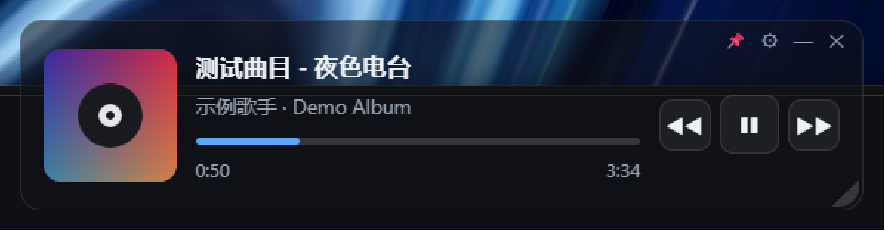

# FloatTune（浮音）

> 一个常驻桌面的 **悬浮音乐控件** —— 控制「系统当前正在播放的任意播放器」。

**FloatTune** 是一个轻量的 Windows 桌面小组件。它**不绑定任何特定音乐软件**，而是通过 **Windows 系统媒体接口（SMTC / GSMTC）** 控制你电脑上正在播放的音乐：汽水音乐、网易云、QQ 音乐、Spotify、浏览器里的视频……只要该应用接入了系统媒体控制，FloatTune 就能控制它。

*A lightweight floating media controller for Windows. It controls **whatever** is playing on your PC through the Windows System Media Transport Controls API — no per-app integration required.*

---

## 特性

- 🎵 **通吃任意播放器**（走系统媒体接口，不依赖各平台 SDK）
- 🖼️ 专辑封面 + 歌名 + 歌手
- ⏯️ 播放/暂停、上一首/下一首、进度条（可点击/拖动跳转）
- 🪟 深色半透明悬浮卡片，**真透明 / 亚克力** 两种材质可选
- 📐 可拖动、可缩放，**尺寸与位置自动记忆**
- 📌 **固定窗口**：一键锁定，不能移动/缩放，并强制置顶
- 🧩 **迷你模式**：拖到任务栏自动吸附成小卡片（封面 + 歌名 + 上下首）；双击卡片也能切换
- 🔔 **只占托盘**：不在任务栏占位；托盘图标会变成当前歌曲封面，悬停显示「歌名 - 歌手」
- ⌨️ 全局快捷键（可自定义绑定）
- ⚙️ 设置页：主题（深色/浅色）、主题色、卡片透明度、窗口置顶、开机静默自启、空闲自动隐藏、快捷键录制

## 截图



## 下载安装

| 文件 | 说明 |
|---|---|
| `FloatTune-Setup-x.y.z.exe` | **安装版**：可选安装目录，自动创建桌面/开始菜单快捷方式，内置卸载程序 |
| `FloatTune-Portable-x.y.z.exe` | **免安装单文件版**：双击即用 |
| `FloatTune-Portable-x.y.z.zip` | **绿色压缩包**：解压即用 |

安装后通过 **右下角托盘图标** 或窗口右上角的 **⚙** 进入设置。

> 若开启「真透明窗口」后卡片变成空白，请改回「亚克力材质」（部分环境下真透明不可用）。

## 工作原理

FloatTune 由三部分组成，各司其职：

| 部分 | 位置 | 职责 |
|---|---|---|
| **Electron 界面** | `src/` | 悬浮窗、设置页、托盘、窗口行为、快捷键 |
| **PowerShell 媒体桥** | `bridge/smtc.ps1` | 通过 WinRT 的 `GlobalSystemMediaTransportControlsSessionManager` 读取播放状态、下发控制指令。常驻子进程，指令响应约 50ms，状态轮询 600ms |
| **原生封面组件** | `native/SmtcArt/`（C# / .NET 8） | **PowerShell 5.1 无法读取 WinRT 流**（对象以 `__ComObject` 返回，无法转成 `IInputStream`），因此专辑封面由这个独立小程序解码写盘 |

设计上的两个要点：
- **桥接绝不阻塞**：所有 WinRT 调用都带硬超时（4–5 秒），封面组件以**分离进程**启动、靠检测文件更新来收取结果 —— 任何一个环节卡死都不会冻结界面。
- **进度条自走时钟**：部分播放器（如汽水音乐）上报的播放位置是「冻结十几秒 → 猛跳一段」的，因此进度条用自己的时钟平滑推进，只在播放器真正报了新值时重新定锚。

## 从源码构建

需要：**Node.js 18+**、**.NET 8 SDK**（仅用于编译封面组件）、Windows 10/11。

```bash
# 1. 安装依赖
npm install

# 2. 编译原生封面组件（输出到 native/）
dotnet publish native/SmtcArt/SmtcArt.csproj -c Release -r win-x64 --self-contained false -o native -p:PublishReadyToRun=true

# 3. 开发运行
npm start
npm run start:mock      # 用模拟数据预览界面，不需要真的放歌
npm run dist            # 打包：NSIS 安装版 + 免安装单文件
```

> 若 npm 的 install-scripts 策略拦截了 Electron 的安装脚本，手动补一次：`node node_modules/electron/install.js`
>
> 若构建时连不上 GitHub（electron-builder 需要从 GitHub 拉 NSIS 等工具链），可设镜像：
> `ELECTRON_BUILDER_BINARIES_MIRROR=https://registry.npmmirror.com/-/binary/electron-builder-binaries`

## 配置

配置文件位于 `%APPDATA%\FloatTune\config.json`：

| 键 | 说明 |
|---|---|
| `width` / `height` / `x` / `y` | 窗口尺寸与位置（自动写入） |
| `theme` / `accent` | 主题（`dark`/`light`）与主题色 |
| `cardAlpha` | 卡片透明度（0–1） |
| `acrylic` / `transparentWindow` | 亚克力材质 / 真透明窗口（二选一，重启生效） |
| `alwaysOnTop` | 窗口置顶 |
| `locked` | 固定窗口（锁定位置与大小） |
| `autostart` | 开机静默自启 |
| `autoHideIdle` / `idleGraceMs` | 没在播放时自动隐藏及延迟 |
| `hotkeys` | 全局快捷键绑定 |

## 已知限制

- **独占全屏**游戏无法被任何覆盖层覆盖，需要把游戏切成「无边框窗口全屏」。
- **亚克力材质在窗口失焦时**会被 Windows 渲染为不透明（系统对非活动窗口的固有为），此时建议改用「真透明窗口」。
- 部分播放器上报的**播放位置不连续**（冻结后跳变），因此进度条只能近似跟随（已用自走时钟平滑）。
- 迷你卡片按设计**不显示进度条**（只有封面、歌名、上下首）。
- 原生封面组件需要 **.NET 8 运行时**（安装 .NET 8 SDK 即包含）。

## 项目结构

```
src/                  Electron 主进程 + 渲染进程
  main.js             窗口、置顶、托盘、热键、迷你模式、锁定、设置窗口
  preload.js          IPC 桥
  renderer/           主界面（index.html / style.css / app.js）
  settings/           设置页
  assets/             图标资源（应用图标 + 任务栏按钮图标）
bridge/smtc.ps1       Windows 媒体桥（WinRT SMTC + CoreAudio）
native/SmtcArt/       原生封面组件（C# / .NET 8）
tools/                开发辅助（图标生成、模拟播放源、状态监视器）
build/icon.ico        应用图标
```

## License

MIT
